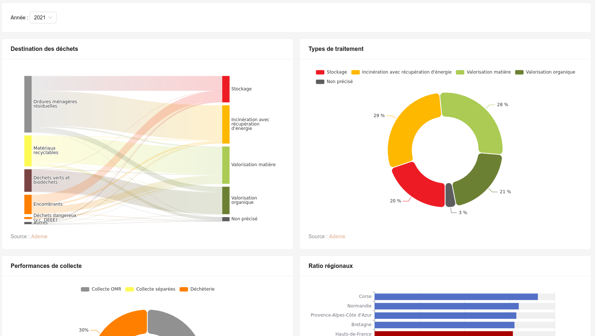

# Odema-dashboard



## Mise en route

```bash
git clone git@github.com:geo2france/odema-dashboard.git
git submodule init
git submodule update
npm install
npm run dev
```

Compilation et génération de la doc : 
```bash
npm run build
npm run generate-docs
```


Le contenu généré dans le dossier `dist` peut être coller sur un serveur http sans configuration particulière.

## Sources de données

- **Ademe** : depuis le [portail opendata](https://data.ademe.fr/) de l'Ademe via l'API Datafair.
- **Odema** : depuis le [datahub](https://www.geo2france.fr/datahub/search?q=odema) de Géo2France par flux WFS.

Les connecteurs [Datafair Data Provider](https://github.com/geo2france/refine-datafair) et [WFS Data Provider](https://github.com/geo2france/refine-wfs) ont été développés pour cet usage et sont utilisables par d'autres applications [Refine](https://github.com/refinedev/refine).

## Développement

### DashboardElement

Le composant [DashboardElement](src/components/dashboard_element/index.tsx) peut-être utilisé pour ajouter des fonctionnalités à un _element_ (graphique ou cartographique) de tableau de bord.
Il ajoute :
- Une _card_ servant de conteneur, avec titre et crédit.
- Un menu contextuel permettant à l'utilisateur de :
    - Afficher le contenu en plein écran
    - Exporter le contenu en format image (png)

Pour fonctionner correctement, le composant enfant doit exporter la référence de l'élément graphique (_echart_ ou _maplibre_) à l'aide de du hook `useDashboardElement`.

Exemples :
```typescript
export const MapIsdnd: React.FC<IMapProps> = ({ data, style }) => {
  const mapRef = useRef<any>(null);
  useDashboardElement({chartRef:mapRef})
  [...]
  return (
    <Map
      reuseMaps
      preserveDrawingBuffer={true}
      ref={mapRef}
      style={style} [...]/>
    )
}
```
Pour les cartes, la propriété `preserveDrawingBuffer={true}` est nécessaire pour permettre l'export PNG (sinon, le fichier exporté sera blanc).

```typescript
export const ChartIsdndGlobal: React.FC<IChartIsdndGlobalProps> = ({ data, style}) => {
    const chartRef = useRef<any>();
    useDashboardElement({chartRef})
    [...]
    return (
        <ReactECharts
        option={option} ref={chartRef} style={style} />
    )
}
```

### useChartEvents

Le hook `useChartEvents` permet de définir des fonctions callback à executer au click (_onClick_) ou au survol (_onFocus_) des graphiques.
Le callback reçoit comme paramètres un objet qui contient des informations sur l'élément qui l'a déclanché (nom de la série, données, etc.). La structure de l'objet varie selon le type de graphique.

Généralement, le callback sera une fonction qui va modifier un état (_state_) du parent (_setState_).

TODO : Exemple concret montrant comment l'année cliquée sur le graphique est remontée à la page.

Exemple :
```typescript
    useChartEvents({chartRef, onFocus})
```

### useChartActionHightlight

Le hook `useChartActionHightlight` permet de manuellement mettre en évidence (_highlight_) une portion du graphique.
L'élement à éclairer peut-être défini par son nom ou le nom de sa série (ou plus rarement son index).

TODO : Exemple concret avec _bar_ et _pie_ et cas d'usage.

Notes : le _hilight_ est un effet subtil. Souvent on privilégiera un changement de couleur pour mettre en évidence une information importante (par exemple l'année sélectionnée).
Le _hilight_ sera plus souvent utilisé pour mettre un évidence un élément similaire à plusieurs graphique lors du survol d'un des deux graphique.

## Learn More

To learn more about **Refine**, please check out the [Documentation](https://refine.dev/docs)

- **Ant Design** [Docs](https://refine.dev/docs/ui-frameworks/antd/tutorial/)
- **React Router** [Docs](https://refine.dev/docs/core/providers/router-provider/)
- **REST Data Provider** [Docs](https://refine.dev/docs/core/providers/data-provider/#overview)
- **Datafair Data Provider** [Docs](https://github.com/geo2france/refine-datafair)
- **WFS Data Provider** [Docs](https://github.com/geo2france/refine-wfs)

This [Refine](https://github.com/refinedev/refine) project was generated with [create refine-app](https://github.com/refinedev/refine/tree/master/packages/create-refine-app).


## License

MIT
